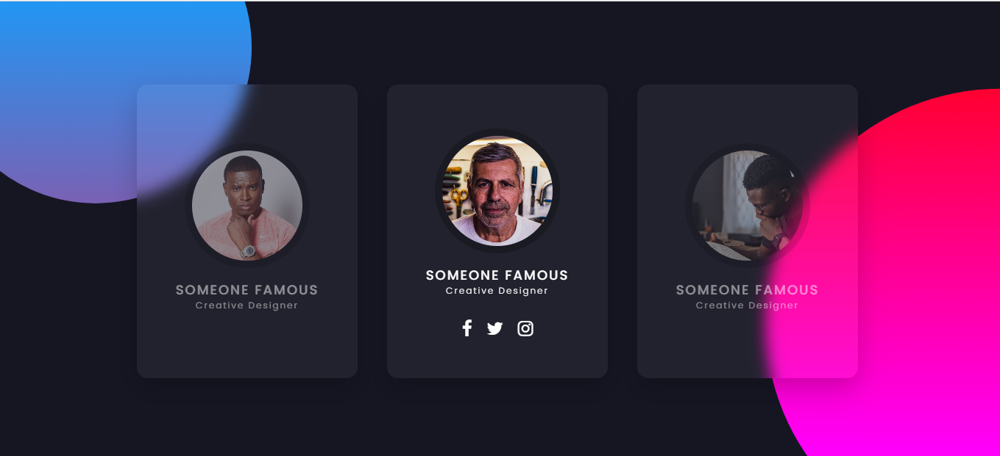

# Sessão Time Brad

	</a>
  

## 👨🏻‍💻 Olá visitante, um pouco sobre este projeto....

Criação de Card's com efeito 3D para apresentação de membros que compõe o time.

Um pouco do que utilizei:

- [HTML5](https://developer.mozilla.org/pt-BR/docs/Web/HTML/HTML5)
- [CSS3](https://www.w3schools.com/css/)
- [Vanilla Tilt.js](https://micku7zu.github.io/vanilla-tilt.js/)

Made with 💜 &nbsp;by Diego Henrique 👋 &nbsp;[See my linkedin](https://www.linkedin.com/in/diego-henrique-reports/)